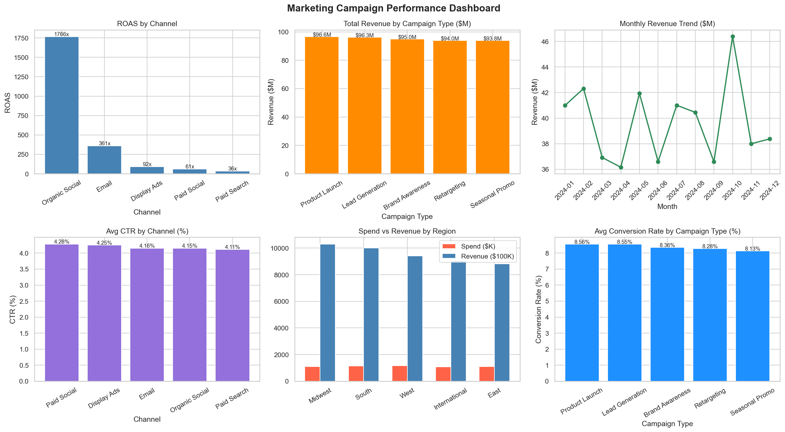

# Marketing Campaign Performance Dashboard

**Tools:** SQL · Python · pandas · Matplotlib · Seaborn · Power BI  
**Author:** Nurbol Sultanov | [LinkedIn](https://www.linkedin.com/in/everinurmind/) | [GitHub](https://github.com/everinurmind)

---


---

## Project Overview

Analysis of 5,000 marketing campaigns across 5 channels, 5 campaign types, and 5 regions over 2024. Built to identify top-performing channels, optimize spend allocation, and surface actionable insights for marketing strategy.

**Business Questions Answered:**
- Which channel delivers the highest ROAS?
- Which campaign type drives the most conversions?
- How does performance vary by region?
- What are the monthly revenue trends?

---

## Dataset

- **Records:** 5,000 campaigns
- **Date range:** January 2024 – December 2024
- **Channels:** Email, Paid Social, Organic Social, Paid Search, Display Ads
- **Metrics:** impressions, clicks, conversions, spend, revenue, CTR, conversion rate, CPA, ROAS

---

## Key Findings

| Metric | Result |
|---|---|
| Total spend | $5.6M |
| Total revenue | $475.8M |
| Overall ROAS | 84.84x |
| Top channel by ROAS | Organic Social (1,765x) |
| Top channel by revenue | Display Ads ($96.6M) |
| Best campaign type | Lead Generation ($96.3M) |
| Top region | Midwest ($103M revenue) |
| Best month | October ($46.4M revenue) |

---

## Dashboard Preview



---

## Insights

- **Organic Social** has the highest ROAS (1,765x) because spend is near-zero — ideal for brand building with minimal budget
- **Paid Search** has the lowest ROAS (35x) but highest spend ($2.6M) — needs optimization or reallocation
- **Lead Generation** campaigns outperform across all channels — prioritize this type for growth
- **October** is the strongest month — allocate more budget ahead of Q4
- **Midwest** delivers the best revenue per dollar spent (93.48x ROAS)

---

## Project Structure
```
├── data/
│   ├── generate_data.py          # Dataset generation script
│   ├── marketing_data.csv        # Generated dataset (5,000 campaigns)
│   ├── campaign_analysis.png     # Python visualizations
│   └── marketing_dashboard.pbix  # Power BI dashboard
├── notebooks/
│   ├── 01_sql_analysis.py        # SQL queries via SQLite
│   └── 02_visualizations.py      # Python charts
└── README.md
```

---

## How to Run
```bash
# 1. Install dependencies
pip install pandas numpy matplotlib seaborn

# 2. Generate dataset
python data/generate_data.py

# 3. Run SQL analysis
python notebooks/01_sql_analysis.py

# 4. Generate visualizations
python notebooks/02_visualizations.py

# 5. Open Power BI dashboard
# Open data/marketing_dashboard.pbix in Power BI Desktop
```